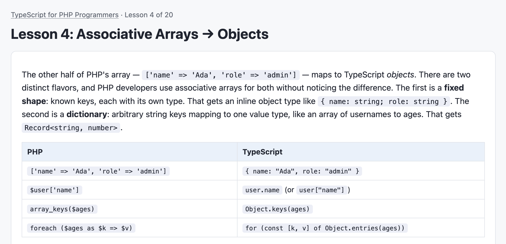

# X for Y Programmers

Interactive tutorial courses that teach one language to programmers who
already know another. Each lesson shows a familiar idiom from the language you
know beside a small problem to solve in the language you're learning, then
compiles and tests your answer. This repository is almost entirely AI-generated,
but I've found it useful in updating my knowledge after programming in PHP for
the last 20 years.



TypeScript courses run entirely in the browser (vendored compiler, fully
offline). Rust courses compile and run your code via the
[Rust Playground](https://play.rust-lang.org) API, and PHP and Ruby courses
via [Wandbox](https://wandbox.org), so those need an internet connection.

## TypeScript courses

- **[typescript-for-javascript-programmers](typescript-for-javascript-programmers/index.html)** — TypeScript for JavaScript Programmers (teaches the type layer; the runtime is assumed known)
- **[typescript-for-python-programmers](typescript-for-python-programmers/index.html)** — TypeScript for Python Programmers
- **[typescript-for-java-programmers](typescript-for-java-programmers/index.html)** — TypeScript for Java Programmers
- **[typescript-for-csharp-programmers](typescript-for-csharp-programmers/index.html)** — TypeScript for C# Programmers
- **[typescript-for-cpp-programmers](typescript-for-cpp-programmers/index.html)** — TypeScript for C++ Programmers
- **[typescript-for-go-programmers](typescript-for-go-programmers/index.html)** — TypeScript for Go Programmers
- **[typescript-for-rust-programmers](typescript-for-rust-programmers/index.html)** — TypeScript for Rust Programmers
- **[typescript-for-ruby-programmers](typescript-for-ruby-programmers/index.html)** — TypeScript for Ruby Programmers
- **[typescript-for-php-programmers](typescript-for-php-programmers/index.html)** — TypeScript for PHP Programmers

## Rust courses

A shared 20-lesson Rust curriculum (mutability, ownership, borrowing,
Option/Result, structs, enums + match, traits, generics, iterators, lifetimes,
derive, modules, threads, capstone), framed for each source language:

- **[rust-for-typescript-programmers](rust-for-typescript-programmers/index.html)** — Rust for TypeScript Programmers
- **[rust-for-javascript-programmers](rust-for-javascript-programmers/index.html)** — Rust for JavaScript Programmers
- **[rust-for-python-programmers](rust-for-python-programmers/index.html)** — Rust for Python Programmers
- **[rust-for-java-programmers](rust-for-java-programmers/index.html)** — Rust for Java Programmers
- **[rust-for-csharp-programmers](rust-for-csharp-programmers/index.html)** — Rust for C# Programmers
- **[rust-for-cpp-programmers](rust-for-cpp-programmers/index.html)** — Rust for C++ Programmers
- **[rust-for-go-programmers](rust-for-go-programmers/index.html)** — Rust for Go Programmers
- **[rust-for-ruby-programmers](rust-for-ruby-programmers/index.html)** — Rust for Ruby Programmers
- **[rust-for-php-programmers](rust-for-php-programmers/index.html)** — Rust for PHP Programmers

## PHP courses

A shared 20-lesson PHP curriculum (variables, strings, PHP's one-array-type
for lists and dicts, functions with named arguments, null handling, type
juggling and `===`, `match`, classes with promoted properties, interfaces,
enums, traits, `array_map`/`array_filter`, destructuring and spread, closures
with explicit `use` capture, exceptions, static/const/readonly, generators,
JSON, capstone), framed for each source language:

- **[php-for-typescript-programmers](php-for-typescript-programmers/index.html)** — PHP for TypeScript Programmers
- **[php-for-javascript-programmers](php-for-javascript-programmers/index.html)** — PHP for JavaScript Programmers
- **[php-for-python-programmers](php-for-python-programmers/index.html)** — PHP for Python Programmers
- **[php-for-java-programmers](php-for-java-programmers/index.html)** — PHP for Java Programmers
- **[php-for-csharp-programmers](php-for-csharp-programmers/index.html)** — PHP for C# Programmers
- **[php-for-cpp-programmers](php-for-cpp-programmers/index.html)** — PHP for C++ Programmers
- **[php-for-go-programmers](php-for-go-programmers/index.html)** — PHP for Go Programmers
- **[php-for-ruby-programmers](php-for-ruby-programmers/index.html)** — PHP for Ruby Programmers
- **[php-for-rust-programmers](php-for-rust-programmers/index.html)** — PHP for Rust Programmers

## Ruby courses

A shared 20-lesson Ruby curriculum (variables with no declarations, string
interpolation, arrays, hashes and symbols, methods with implicit return, nil
and safe navigation, everything-is-an-object, case/when, classes, inheritance
and modules, blocks/procs/lambdas, Enumerable, destructuring and splat, duck
typing, exceptions, Structs and Comparable, enumerators and lazy, JSON,
capstone), framed for each source language:

- **[ruby-for-typescript-programmers](ruby-for-typescript-programmers/index.html)** — Ruby for TypeScript Programmers
- **[ruby-for-javascript-programmers](ruby-for-javascript-programmers/index.html)** — Ruby for JavaScript Programmers
- **[ruby-for-python-programmers](ruby-for-python-programmers/index.html)** — Ruby for Python Programmers
- **[ruby-for-java-programmers](ruby-for-java-programmers/index.html)** — Ruby for Java Programmers
- **[ruby-for-csharp-programmers](ruby-for-csharp-programmers/index.html)** — Ruby for C# Programmers
- **[ruby-for-cpp-programmers](ruby-for-cpp-programmers/index.html)** — Ruby for C++ Programmers
- **[ruby-for-go-programmers](ruby-for-go-programmers/index.html)** — Ruby for Go Programmers
- **[ruby-for-rust-programmers](ruby-for-rust-programmers/index.html)** — Ruby for Rust Programmers
- **[ruby-for-php-programmers](ruby-for-php-programmers/index.html)** — Ruby for PHP Programmers

Open a course's `index.html` in a browser, or serve the whole directory:

```sh
python3 -m http.server 8000
```

## Layout

```
X-for-Y-Programmers/
├── shared/                  libraries shared by every course
│   ├── css/style.css        theme (light/dark), generic .source-panel accent
│   ├── js/harness.js        renders lessons, compiles + tests learner code
│   ├── js/vendor/typescript.min.js   vendored TypeScript compiler (offline)
│   └── tools/validate.js    proves every lesson is solvable
└── <course>/                one directory per course, named x-for-y-programmers
    ├── index.html           lesson list with progress checkmarks
    ├── js/course.js         course config (see below)
    ├── js/manifest.js       lesson filenames/titles, drives nav + index
    └── lessons/NN-*.html    20 self-contained lesson pages
```

## Course config (`js/course.js`)

The shared harness is agnostic to both the source language and the target
language; each course tells it what to display, which `LESSON` field holds the
source-language snippet, and which runner to use:

```js
const COURSE = {
  title: "TypeScript for PHP Programmers",   // page titles & breadcrumb
  sourceHeading: "The PHP you know",          // left-panel heading
  sourceField: "php",                         // LESSON field with source code
  cheatSheetTitle: "PHP ⇄ TypeScript cheat sheet",
  storageKey: "tsphp-completed",              // localStorage progress key
  accent: "#7a6fb0",                          // source-panel accent color
  target: "typescript",                       // "typescript" (in-browser),
                                              // "rust" (Rust Playground API),
                                              // "php" or "ruby" (Wandbox API)
  targetName: "TypeScript",                   // editor heading
};
```

For `target: "rust"`, lesson tests are `{ name, code }` pairs where `code` is
Rust assert statements; the harness appends a generated `main` that runs each
test under `catch_unwind` and reports pass/fail per test. Learner code must
not define `fn main`.

For `target: "php"`, tests are `{ name, code }` pairs of PHP statements using
the harness-provided `expect_eq($actual, $expected)` (strict `===`) and
`expect_true($cond)` helpers; each test runs in its own closure with
`Throwable` caught. Lesson starters and solutions begin with `<?php`.

For `target: "ruby"`, tests are `{ name, code }` pairs of Ruby statements using
`expect_eq(actual, expected)` (`==` comparison) and `expect_true(cond)`; each
test runs in its own `begin`/`rescue Exception` block, so `NotImplementedError`
TODO stubs fail one test rather than aborting the run.

## How a lesson works

Every page in `lessons/` defines a single `LESSON` object:

| Field | Purpose |
| --- | --- |
| `intro` | HTML explaining the concept, anchored to the known language |
| `php` / `python` / … | Source-language snippet for the left panel (name set by `COURSE.sourceField`) |
| `task` | The problem statement |
| `starter` | Code pre-loaded into the editor |
| `requirements` | Regex checks that the answer uses the feature being taught |
| `tests` | Behavior tests run against the compiled code |
| `solution` | Reference solution, revealed on demand |
| `notes` | Cheat-sheet table |

Tests use the `expectEqual`, `expectDeepEqual`, `expectTruthy`, and
`expectThrows` helpers and pass unless they throw; async tests are awaited.

## Validating lessons

`shared/tools/validate.js` checks schema completeness, that the reference
solution satisfies its own requirement regexes, that starter and solution
compile, and that the solution passes all of the lesson's tests. TypeScript
lessons are compiled with the vendored compiler; Rust lessons require a local
`rustc` on the PATH (e.g. `brew install rust`), PHP lessons a local `php`
(e.g. `brew install php`), and Ruby lessons a local Ruby &ge; 3 (e.g.
`brew install ruby`, or point `RUBY_BIN` at one) — the validator runs
everything natively rather than calling the online services:

```sh
node shared/tools/validate.js                                  # every course
node shared/tools/validate.js typescript-for-php-programmers   # one course
node shared/tools/validate.js typescript-for-php-programmers/lessons/07-union-types.html
```

## Adding a course

1. Create `<x>-for-<y>-programmers/` with `js/course.js` (pick a new
   `sourceField`, `storageKey`, and accent), `js/manifest.js`, `index.html`
   (copy one from an existing course and edit the hero paragraph), and a
   `lessons/` directory.
2. Copy any existing lesson as a template — only the `<title>` and the inline
   `LESSON` object change; the `<script src>` paths stay the same.
3. Run `node shared/tools/validate.js <your-course>` until everything is `ok`.

## Adding a lesson to an existing course

1. Copy an existing lesson file and edit its `LESSON` object.
2. Add an entry to the course's `js/manifest.js`.
3. Run the validator.
